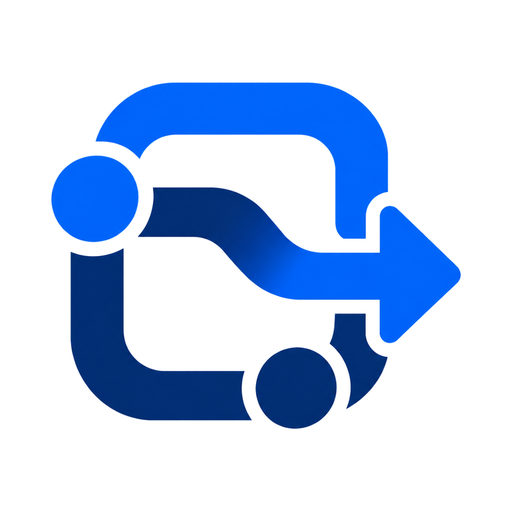
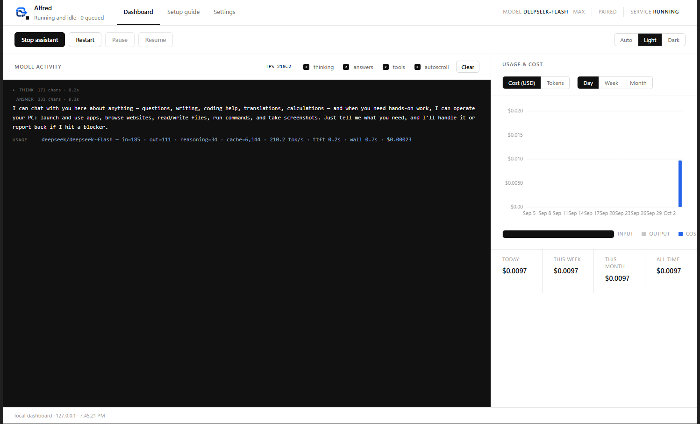
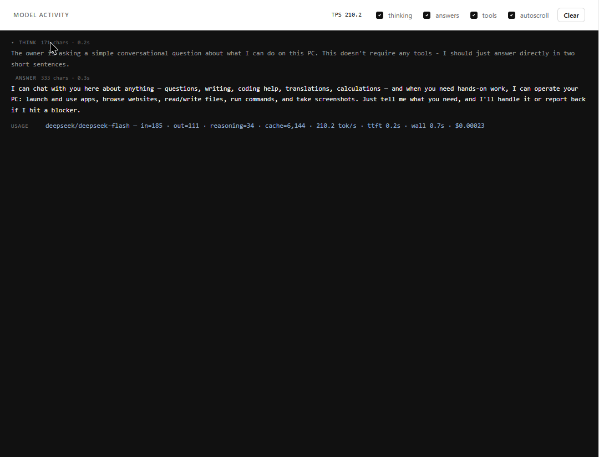
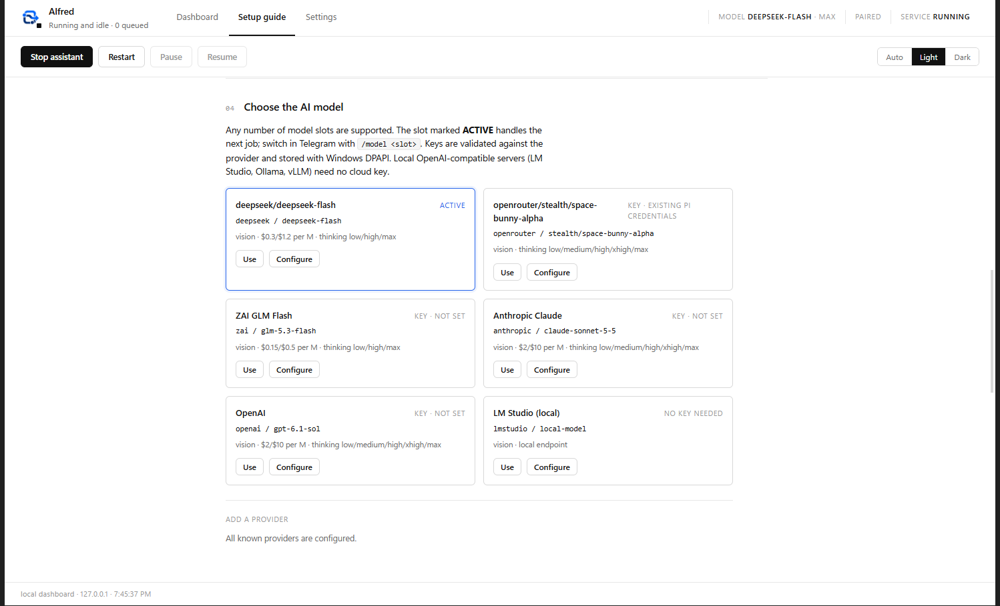
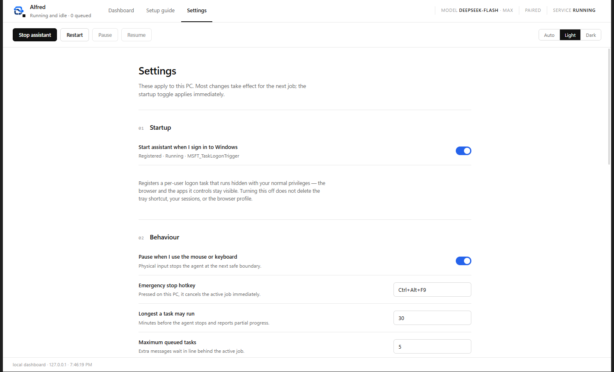

<p align="center">
  
</p>

<h1 align="center">Alfred</h1>

<p align="center">
  <strong>A private, Telegram-controlled assistant that operates your Windows PC.</strong><br />
  It drives a real visible Chrome window, native Windows apps, files and PowerShell —<br />
  and answers you in the same chat with text, screenshots and files.
</p>

<p align="center">
  <a href="LICENSE"></a>
  
  
  
</p>



---

## What it is

Alfred is a single-user agent that lives on your PC and listens to **one private Telegram chat**.
You send a message; it opens apps, browses the web in a visible Chrome window, reads and writes
files, runs commands, takes screenshots and reports back. Every job runs in a disposable worker
process, so a crash, a hang or a runaway model call never takes the assistant down.

It is built on the [Pi SDK](https://github.com/earendil-works) and runs alongside any existing Pi
installation without touching it — its own config, database, sessions and browser profile.

```text
Telegram private chat
        │
        ▼
  Supervisor  ── auth · queue · outbox · jobs · approvals · SQLite
        │
        ├── disposable Pi SDK worker   (one job, one process, hard limits)
        ├── Windows-MCP backend        (accessibility, mouse, keyboard, screenshots)
        ├── Playwright MCP backend     (a visible Chrome window, pinned profile)
        └── files · PowerShell · Telegram outbox
```

## Example chat

```text
You   › open notepad, type a recipe for banana bread, save it to my Documents as bread.txt
Alfred › On it. Opening Notepad and typing the recipe.
        ▸ opened notepad.exe
        ▸ typed 812 characters
        ▸ saved to C:\Users\you\Documents\bread.txt
        ▸ screenshot attached
        Done — saved as bread.txt (1.1 KB).

You   › /model openrouter
Alfred › Active model is now openrouter/anthropic/claude-sonnet-4.5 (thinking high).

You   › what's on my screen right now?
Alfred › [screenshot]  Your screen shows Notepad with bread.txt and Chrome on a news page.
```

## Features

| | |
|---|---|
| **Telegram-first control** | One private chat. No open ports, no web UI to expose — the bot uses long polling to Telegram only. |
| **Real browser automation** | A visible Chrome window on a dedicated, persistent profile. Sign in once; cookies survive restarts. Your normal Chrome profile is never opened. |
| **Real desktop automation** | Native Windows UI Automation: launch apps, read the accessibility tree, click, type, drag, screenshot. |
| **Files & shell** | Read/write files, run PowerShell with timeouts, collect artifacts and send them to chat. |
| **Model-agnostic** | DeepSeek, OpenRouter, ZAI (GLM), Anthropic, OpenAI, or a local OpenAI-compatible server (LM Studio, Ollama, vLLM). Switch slots from chat with `/model`. |
| **Bounded by design** | Per-job walls: max run time, tool calls, model turns, no-progress detection, queue limits, graceful cancel. |
| **Safety rails** | Owner allowlist, one-time-code pairing, approval prompts for destructive actions, pause-on-human-input, a local emergency hotkey, and a `dryRun` mode. |
| **Secrets that stay local** | Bot token and provider keys are stored with Windows DPAPI for your user and injected into workers in memory only — never written to disk in plain text. |
| **Dashboard & tray** | A local dashboard (127.0.0.1, token-protected) with setup wizard, live model activity, token/cost charts and settings; plus a tray icon with start/stop/pause. |
| **Honest telemetry** | Every response reports input/output/reasoning tokens, decode tok/s, time-to-first-token, wall time and cost — streamed live into the dashboard. |
| **Ships signed setup** | One double-click installer: checks prerequisites, creates the Python venv, installs pinned deps, generates your config and walks you through the wizard. |

## Screenshots

| Model activity | Setup guide | Settings |
|---|---|---|
|  |  |  |

## Quick start

> Full walkthrough, with every click and every error explained: **[docs/getting-started.md](docs/getting-started.md)**

1. **Install prerequisites** — Windows 10/11, [Node.js 24](https://nodejs.org/), [Python 3.14](https://www.python.org/downloads/windows/) (tick *Add python.exe to PATH*), Google Chrome.
2. **Get the code**
   ```powershell
   git clone https://github.com/Dwekatius/alfred.git
   cd alfred
   ```
   (or download the ZIP and extract it)
3. **Run `Setup Alfred.cmd`** — it builds the venv, installs dependencies and opens the Setup guide.
4. **Follow the wizard (steps 1–6)** — create a bot with **@BotFather**, paste the token, pair your chat, add a model API key, and sign in to the sites the assistant should use.
5. **Send a message** to your bot: `open notepad and write hello`, then watch the dashboard.

The assistant must be able to see the desktop: keep the PC unlocked and logged in while it works.

## Documentation

| Document | What is inside |
|---|---|
| [Getting started](docs/getting-started.md) | The complete guide: prerequisites → bot → pairing → keys → first task → autostart → updates → uninstall. |
| [Architecture](docs/architecture.md) | Supervisor, workers, tool broker, backends, database, telemetry, job lifecycle. |
| [Configuration](docs/configuration.md) | Every `config.json` field, model slots, thinking levels, chat commands, local scripts. |
| [Security](docs/security.md) | Threat model, secret storage, pairing, approvals, network surface, prompt injection, data retention. |
| [Troubleshooting](docs/troubleshooting.md) | Symptom → cause → fix for the errors you are most likely to hit. |
| [Contributing](CONTRIBUTING.md) | Dev setup, tests, layout, style, PR flow. |

## Requirements

- **Windows 10/11**, signed in interactively. Desktop automation cannot work on a locked screen,
  on a secure/UAC desktop, or in Session 0.
- **Node.js 24.15.x** (pinned in `package.json`).
- **Python 3.14** — `Setup Alfred.cmd` creates a project-local `.venv` from pinned requirements.
- **Google Chrome** (the assistant opens its own window and profile).
- A **Telegram bot token** from [@BotFather](https://t.me/BotFather), and an API key for the model
  provider you choose. Local OpenAI-compatible servers need no cloud key.

## Local controls

```powershell
npm run doctor          # 24 environment/session/credential checks
npm run status          # controller status from a terminal
npm run stop            # graceful shutdown
npm run tray -- -Action start|stop|restart|pause|resume|status
```

- **Dashboard** — `http://127.0.0.1:<port>` with a per-install token; opens as a clean app window
  automatically when you double-click the single *Alfred* desktop shortcut. That shortcut starts
  the assistant and opens the dashboard; `npm run install-shortcut` installs it or repairs older shortcuts.
- **Emergency hotkey** — `Ctrl+Alt+F9` cancels the active job immediately.
- **Pause on human input** — if you touch the mouse or keyboard while a job is driving the PC,
  the agent stops at the next safe boundary and asks whether to resume.

## Limitations

- Windows only (it drives the real desktop and UI Automation).
- Single owner account by design. There is no multi-user mode.
- Telegram polling means commands are not instant-delivered; latency is usually under a second.
- Captchas, MFA prompts and some anti-automation sites will stop the agent — it reports them
  instead of guessing.
- Elevation (UAC) is never bypassed. Administrator-only actions are reported, not performed.
- The model provider receives your prompts and the content it is asked to read — treat it like any
  cloud assistant, and keep secrets out of prompts.

## Development

```powershell
npm ci
npm run build         # tsc
npm test              # 68 tests: unit + integration (62 pass, 6 skipped by default)
npm run typecheck
npm run dev           # run the controller in the foreground
```

- `src/supervisor.ts` — orchestration, admission, queue, telemetry.
- `src/pi/worker-main.ts` — the disposable Pi SDK worker (streams deltas and usage over IPC).
- `src/tools/broker.ts` — tool routing, policy, approvals, desktop lease.
- `src/storage/migrations.ts` — SQLite schema and migrations.
- `dashboard/` — the local UI (plain HTML/CSS/JS, no framework, no build step).

Optional live gates (real providers, real desktop, real browser):

```powershell
$env:PI_TG_LIVE_DEEPSEEK = "1"; node --test dist/tests/integration/live-worker.test.js
$env:PI_TG_LIVE_DESKTOP  = "1"; node --test dist/tests/integration/live-desktop.test.js
$env:PI_TG_LIVE_BROWSER  = "1"; node --test dist/tests/integration/live-browser.test.js
```

## License

MIT — see [LICENSE](LICENSE). Third-party licenses, including the Pi SDK and the GPL/LGPL tools
used at runtime but **not bundled**, are listed in [THIRD_PARTY_NOTICES.md](THIRD_PARTY_NOTICES.md).

Alfred is an independent project and is not affiliated with, endorsed by, or named after the macOS
launcher of the same name; the name is a working title and may change.
"Playwright" and "Chrome" are trademarks of their respective owners.

## Responsible use

Alfred can click, type, browse and run commands on your machine with your privileges — that is the
point, and it is also the risk. Run it on a machine you own, keep the bot token and API keys
secret, review [docs/security.md](docs/security.md), and use `dryRun` while you are learning what
it does.
